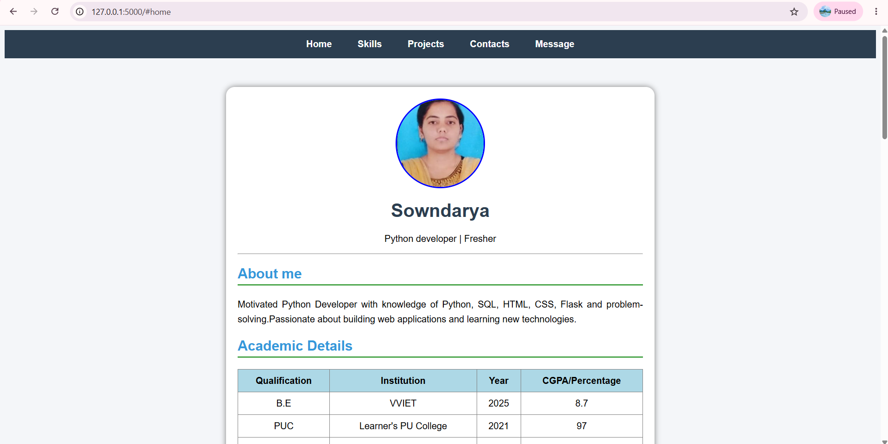
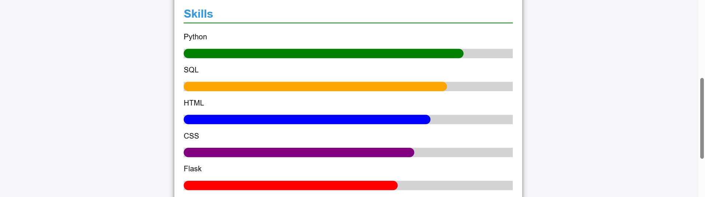
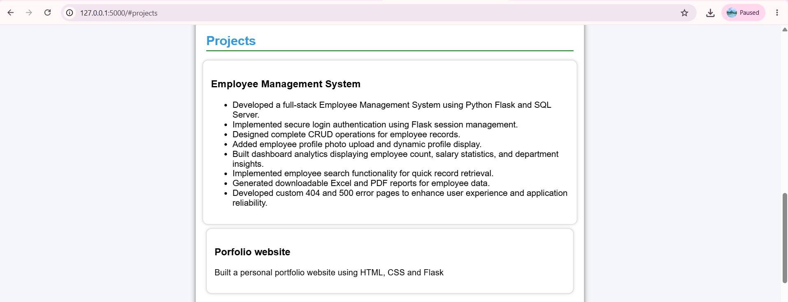

# 🌐 Personal Portfolio Website

A responsive Personal Portfolio Website developed using **Python, Flask, HTML, and CSS** to showcase my profile, technical skills, education, projects, achievements, and contact information.

---

## 🚀 Features

- 👤 About Me section
- 🎓 Academic Details
- 💻 Technical Skills with Progress Bars
- 📂 Projects Section
- 📞 Contact Information
- 🔗 GitHub & LinkedIn Profile Links
- 📝 Contact Form
- 📱 Responsive Design
- ✨ Modern User Interface with Hover Effects

---

## 🛠 Technologies Used

- Python
- Flask
- HTML5
- CSS3
- Jinja2 Templates

---

## 📁 Project Structure

```
Personal-Portfolio/
│
├── app.py
├── requirements.txt
├── README.md
│
├── static/
│   └── profile.jpeg
│
├── templates/
│   └── index.html
│
└── screenshots/
    ├── Homepage.png
    ├── Skills.png
    └── projects.png
```

---

## ⚙️ Installation

### 1. Clone the repository

```bash
git clone https://github.com/Sowndarya128/Personal-Portfolio.git
```

### 2. Move to the project folder

```bash
cd Personal-Portfolio
```

### 3. Create a virtual environment

```bash
python -m venv venv
```

### 4. Activate the virtual environment

**Windows**

```bash
venv\Scripts\activate
```

### 5. Install dependencies

```bash
pip install -r requirements.txt
```

### 6. Run the Flask application

```bash
python app.py
```

### 7. Open your browser

```
http://127.0.0.1:5000
```

---

## 📷 Screenshots

### 🏠 Home Page



---

### 💻 Skills Section



---

### 📂 Projects Section



---

## 📂 Projects Included

### Employee Management System

- Built using Python Flask and SQL Server
- Secure Login Authentication
- CRUD Operations
- Employee Profile Photo Upload
- Dashboard Analytics
- Employee Search
- Excel and PDF Report Generation
- Custom Error Pages (404 & 500)

### Personal Portfolio Website

- Responsive Design
- Skills Progress Bars
- Contact Form
- GitHub & LinkedIn Integration

---

## 🎯 Future Improvements

- Dark Mode
- Email Integration
- Visitor Counter
- Project Filtering
- Deploy on Render

---

## 👩‍💻 Author

**Sowndarya R**

📧 Email: sowndaryaraj128@gmail.com

🔗 GitHub: https://github.com/Sowndarya128

💼 LinkedIn: https://www.linkedin.com/in/sowndarya-chauhan-7898542b7/

---

## ⭐ Support

If you found this project helpful, please give it a ⭐ on GitHub.

Thank you for visiting my repository!